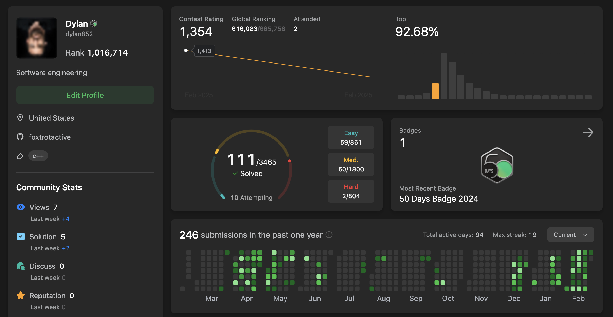

<h1> My Systematic Approach to Conquering the Coding Interview</h1>

<figure>
    
    <figcaption>My leetcode</figcaption>
</figure>

I am currently preparing for technical interviews and would like to share my current approach at this time, as well as my daily routine, to manage my learning. 

I feel like writing this helps me solidify my 

## Method 1: Leetcode

Every day I aim to spend 60 minutes working on a leetcode problem from either
- Blind 75
- Top Interview Questions

For a daily metric, I aim to either:
- Spend 60 minutes working 
- Complete 2 problems

I find this two daily goal to be better than just purely x amount of problems, as this way I am able to go deeper in a single problem without the pressure to solve x amount of problems. 

For each problem, I first write seudo code / comments, as if I was in an interview, then solve the problem. 

If I get stuck on an implementation (spending more than 45 minutes) I consult a solution. I find th

## Method 2: Competitive Programming

I joined my universities competitve coding club, in an attempt to increase stimuli outside of normal leetcode grinding. This way I have a more structured way of gaining exposure to data structures and algorithms. I also plan on  

